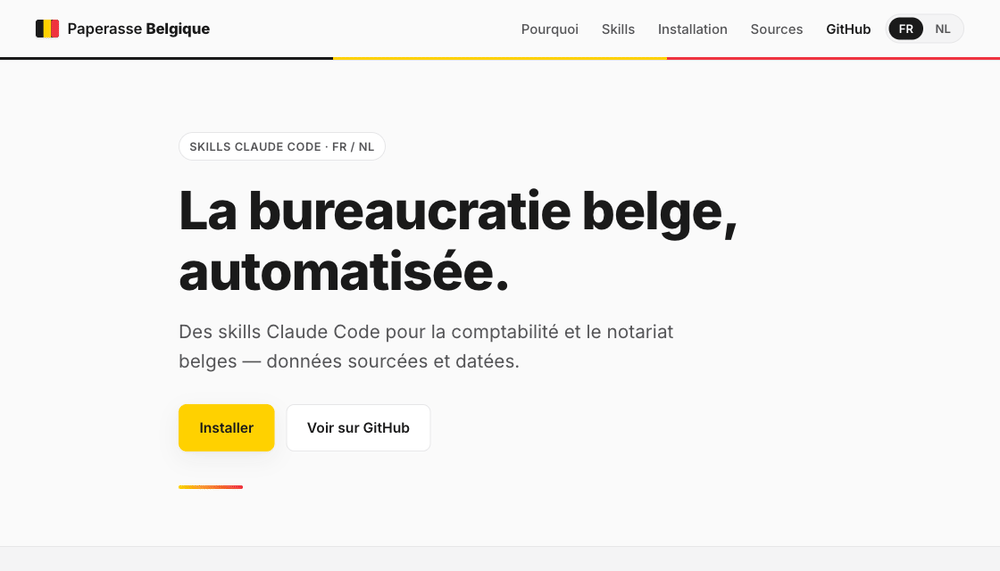

# Paperasse Belgique

[](https://github.com/Hichamdz85/paperasse-belgique/actions/workflows/quality.yml)
[](https://hichamdz85.github.io/paperasse-belgique/)
[](LICENSE)
[](glossaire-fr-nl.json)
[](data/sources.json)
[](https://docs.claude.com/en/docs/claude-code)
[](evals/)

> Skills Claude Code pour automatiser la comptabilité, le notariat, les ASBL, les indépendants et l'organisation documentaire **belges**, en **français et néerlandais**, avec des données **sourcées et datées**.
> Claude Code-skills voor Belgische boekhouding, notariaat, VZW's, zelfstandigen en documentorganisatie, in het **Frans en Nederlands**, met **gedateerde en gecontroleerde bronnen**.

Version **2.4.0** — 5 skills (`comptable-be`, `notaire-be`, `asbl-be`, `classeur-be`, `independant-be`) — données vérifiées au **2026-06-01** ; entrées PCMN et indépendant vérifiées au **2026-06-02** — exercice d'imposition 2026 (revenus 2025).

**Démo en ligne / Live demo : https://hichamdz85.github.io/paperasse-belgique/**



---

## FR — Français

### Présentation

`paperasse-be` est un dépôt de skills Claude Code adaptés au droit et à la comptabilité **de la Belgique** : PCMN/MAR, ISoc/Ven.B, TVA/BTW, dépôt BNB/NBB, BCE/KBO, ASBL/VZW, indépendant personne physique, droits d'enregistrement régionaux, notariat et archivage légal.

Le projet s'inspire de la structure technique du projet français [paperasse](https://github.com/romainsimon/paperasse), mais **tout le contenu juridique et fiscal est belge et original** : la France et la Belgique ont des systèmes différents (PCMN vs PCG, BNB vs Infogreffe, ISoc vs IS, Biztax, Intervat, BCE/KBO, droits régionaux, INASTI/RSVZ).

### Règle d'or : aucune donnée non sourcée

Aucun taux, seuil, échéance ou barème n'est inventé. Chaque donnée chiffrée renvoie à `data/sources.json` ou au `references/sources.json` du skill concerné : source officielle, date de consultation et statut.

Les données non confirmées portent la mention littérale **« À VÉRIFIER — source non confirmée »** et ne sont **jamais** utilisées dans un calcul. Les données `confirme_partiel` ou `confirme_avec_reserve` sont utilisables seulement avec leur réserve explicite.

### Qualité v2.4

Chaque skill respecte le schéma officiel `SKILL.md` (`name`, `description`, `metadata`) et possède une interface `agents/openai.yaml`. Le dépôt inclut une validation locale et GitHub Actions pour contrôler :

- la validité du frontmatter ;
- la présence des métadonnées versionnées ;
- la cohérence des statuts entre `data/sources.json` et les registres de chaque skill ;
- l'exclusion des sources `a_verifier` des calculs ;
- la couverture sourcée via `evals/` (**42/42 assertions**).

### Skills disponibles

| Skill | Couvre |
|-------|--------|
| **comptable-be** | Écritures PCMN/MAR, TVA/BTW, calcul ISoc/Ven.B, clôture annuelle, dépôt BNB/NBB |
| **notaire-be** | Frais de notaire, droits d'enregistrement par région, succession, donation, SRL/BV |
| **asbl-be** | ASBL/VZW : CSA Livre 9, comptabilité simplifiée ou en partie double, dépôt greffe/BNB, IPM, taxe patrimoniale, TVA, registre UBO |
| **classeur-be** | Organisation documentaire, archivage, conservation légale (7/10/15 ans), échéancier fiscal, dashboard, conseils |
| **independant-be** | Indépendant personne physique : IPP, quotité exemptée, frais professionnels, versements anticipés, cotisations INASTI/RSVZ, TVA, comptabilité simplifiée, dossier professionnel |

### Bilinguisme FR/NL

La langue de travail est déterminée par la **région** de l'entreprise ou du siège d'exploitation (`company.json`) :

| `region` | `langue` | Base |
|----------|----------|------|
| `bruxelles` | `fr-nl` (bilingue) | Région bilingue de Bruxelles-Capitale |
| `flandre` | `nl` | Décret du 19/07/1973 |
| `wallonie` | `fr` | Décret du 30/06/1982 (DE pour communes germanophones — hors périmètre actuel) |

La terminologie officielle provient **exclusivement** de [`glossaire-fr-nl.json`](glossaire-fr-nl.json).

### Installation (Claude Code)

```bash
# Cloner le dépôt
git clone https://github.com/Hichamdz85/paperasse-belgique.git paperasse-be
cd paperasse-be

# Valider les sources, les skills et les evals
npm run validate

# Copier les skills vers le répertoire Claude Code
mkdir -p ~/.claude/skills
cp -R comptable-be    ~/.claude/skills/comptable-be
cp -R notaire-be      ~/.claude/skills/notaire-be
cp -R asbl-be         ~/.claude/skills/asbl-be
cp -R classeur-be     ~/.claude/skills/classeur-be
cp -R independant-be  ~/.claude/skills/independant-be

# Vérifier
ls ~/.claude/skills/
```

### Configuration

```bash
cp company.example.json company.json
# Éditer company.json : bce, forme_juridique, regime_tva, exercice, region, langue
```

Valeurs importantes de `forme_juridique` : `SRL`, `SA`, `ASBL`, `personne physique`, `independant_complementaire`.

### Scripts

```bash
node scripts/check-sources.js        # vérifie les registres de sources
node scripts/validate-skills.js      # vérifie SKILL.md, agents/openai.yaml et cohérence des sources
node evals/run-evals.mjs             # evals : couverture sourcée 42/42
node scripts/generate-statements.js  # bilan + compte de résultats (schéma BNB), libellés FR/NL
node scripts/generate-pdfs.js        # document imprimable HTML A4
node scripts/echeancier.mjs          # échéances fiscales légales (+ .ics)
node scripts/dashboard.mjs           # tableau de bord HTML
node scripts/classeur.mjs --init     # arborescence d'archivage + assistant de classement
```

### Avertissement légal

Ces skills sont une aide à la préparation et à la compréhension. Ils **ne remplacent pas** un expert-comptable ITAA, un réviseur IRE, un notaire belge, l'INASTI/RSVZ, une caisse d'assurances sociales, ni le SPF Finances. Vérifiez toujours les sources officielles et leur date avant tout dépôt, déclaration, paiement ou acte.

---

## NL — Nederlands

### Voorstelling

`paperasse-be` is een verzameling Claude Code-skills aangepast aan het **Belgische** recht en de Belgische administratie: MAR/PCMN, vennootschapsbelasting, btw, neerlegging NBB, KBO, VZW, zelfstandige natuurlijke persoon, gewestelijke registratierechten, notariaat en wettelijke archivering.

### Gouden regel: geen ongedocumenteerde gegevens

Geen enkel tarief, drempel, vervaldag of barema wordt verzonnen. Elk cijfer verwijst naar `data/sources.json` of naar het `references/sources.json` van de betrokken skill: officiële bron, raadplegingsdatum en status.

Niet-bevestigde gegevens dragen de vermelding **« À VÉRIFIER — source non confirmée »** en worden **nooit** in een berekening gebruikt. Gegevens met `confirme_partiel` of `confirme_avec_reserve` worden alleen gebruikt met hun expliciete voorbehoud.

### v2.4-kwaliteit

Elke skill volgt het officiële `SKILL.md`-schema (`name`, `description`, `metadata`) en bevat een `agents/openai.yaml` interface. De repository bevat lokale validatie en GitHub Actions voor:

- geldige frontmatter;
- verplichte versie-metadata;
- consistente statussen tussen `data/sources.json` en de skillregisters;
- uitsluiting van `a_verifier`-bronnen uit berekeningen;
- brondekking via `evals/` (**42/42 assertions**).

### Beschikbare skills

| Skill | Behandelt |
|-------|-----------|
| **comptable-be** | MAR/PCMN-boekingen, btw, vennootschapsbelasting, jaarafsluiting, neerlegging NBB |
| **notaire-be** | Notariskosten, gewestelijke registratierechten, erfbelasting, schenkbelasting, BV/NV |
| **asbl-be** | VZW : WVV Boek 9, vereenvoudigde of dubbele boekhouding, neerlegging griffie/NBB, rechtspersonenbelasting, patrimoniumtaks, btw, UBO-register |
| **classeur-be** | Documentorganisatie, archivering, wettelijke bewaartermijnen (7/10/15 jaar), fiscale vervaldagen, dashboard, advies |
| **independant-be** | Zelfstandige natuurlijke persoon: PB, belastingvrije som, beroepskosten, voorafbetalingen, RSVZ-bijdragen, btw, vereenvoudigde boekhouding, professioneel dossier |

### Tweetaligheid FR/NL

De werktaal wordt bepaald door het **gewest** van de onderneming of exploitatiezetel (`company.json`):

| `region` | `langue` | Basis |
|----------|----------|-------|
| `bruxelles` | `fr-nl` (tweetalig) | Tweetalig gebied Brussel-Hoofdstad |
| `flandre` | `nl` | Decreet van 19/07/1973 |
| `wallonie` | `fr` | Decreet van 30/06/1982 (DE voor Duitstalige gemeenten — buiten huidige scope) |

De officiële terminologie komt **uitsluitend** uit [`glossaire-fr-nl.json`](glossaire-fr-nl.json).

### Installatie (Claude Code)

```bash
# Repository klonen
git clone https://github.com/Hichamdz85/paperasse-belgique.git paperasse-be
cd paperasse-be

# Bronnen, skills en evals valideren
npm run validate

# Skills kopiëren naar de Claude Code skills-map
mkdir -p ~/.claude/skills
cp -R comptable-be    ~/.claude/skills/comptable-be
cp -R notaire-be      ~/.claude/skills/notaire-be
cp -R asbl-be         ~/.claude/skills/asbl-be
cp -R classeur-be     ~/.claude/skills/classeur-be
cp -R independant-be  ~/.claude/skills/independant-be

# Controleren
ls ~/.claude/skills/
```

### Bedrijfsconfiguratie

```bash
cp company.example.json company.json
# Bewerk company.json: bce, forme_juridique, regime_tva, exercice, region, langue
```

Belangrijke waarden voor `forme_juridique`: `SRL`, `SA`, `ASBL`, `personne physique`, `independant_complementaire`.

### Scripts

```bash
node scripts/check-sources.js        # controleert de bronregisters
node scripts/validate-skills.js      # controleert SKILL.md, agents/openai.yaml en bronconsistentie
node evals/run-evals.mjs             # evals: brondekking 42/42
node scripts/generate-statements.js  # balans + resultatenrekening (NBB-schema), FR/NL-labels
node scripts/generate-pdfs.js        # afdrukbaar HTML A4-document
node scripts/echeancier.mjs          # wettelijke fiscale vervaldagen (+ .ics)
node scripts/dashboard.mjs           # HTML-dashboard
node scripts/classeur.mjs --init     # archiveringsstructuur + klasseerassistent
```

### Juridische disclaimer

Deze skills zijn een hulpmiddel bij de voorbereiding en het begrip. Zij **vervangen geen** accountant ITAA, bedrijfsrevisor IBR/IRE, Belgische notaris, RSVZ, sociaalverzekeringsfonds of FOD Financiën. Controleer altijd de officiële bronnen en hun datum vóór elke neerlegging, aangifte, betaling of akte.

---

## Structure du dépôt / Structuur

```
paperasse-be/
  README.md                  RESEARCH.md             cadrage sourcé
  company.example.json       package.json            glossaire-fr-nl.json
  data/                      registre central des sources
  evals/                     runner + documentation des evals
  comptable-be/              SKILL.md + agents/ + references/ + data/ + evals/
  notaire-be/                SKILL.md + agents/ + references/ + evals/
  asbl-be/                   SKILL.md + agents/ + references/ + evals/
  classeur-be/               SKILL.md + agents/ + references/ + evals/
  independant-be/            SKILL.md + agents/ + references/ + evals/
  scripts/                   validation, états, échéancier, dashboard, classeur
  templates/                 PV et checklists FR/NL
  site/                      landing page bilingue
```

## Sources officielles / Officiële bronnen

- [CNC – CBN](https://www.cnc-cbn.be)
- [SPF Finances – FOD Financiën](https://finances.belgium.be)
- [Moniteur belge – Belgisch Staatsblad](https://www.ejustice.just.fgov.be)
- [BNB – NBB](https://www.nbb.be) (Centrale des bilans / Balanscentrale)
- [ITAA](https://www.itaa.be)
- [INASTI – RSVZ](https://www.inasti.be)
- [Fednot](https://www.notaire.be) (notaire.be / notaris.be)

Également : SPF Économie – FOD Economie (BCE/KBO) · portails régionaux (be.brussels, vlaanderen.be, wallonie.be).

**FR** — Données vérifiées et datées (consultation : 2026-06-02).  
**NL** — Geverifieerde en gedateerde gegevens (raadpleging: 2026-06-02).

## Licence / Licentie

MIT.
