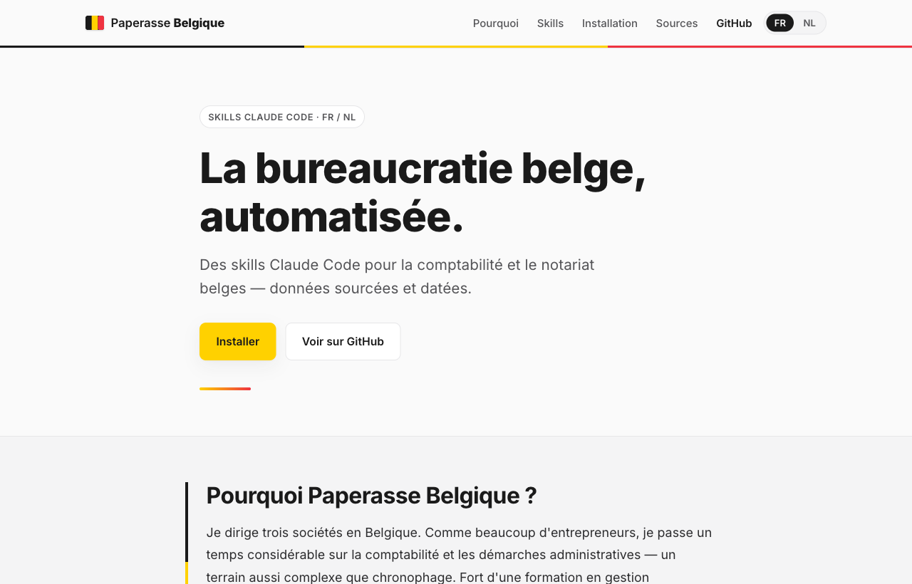

# Paperasse Belgique

[](https://github.com/Hichamdz85/paperasse-belgique/actions/workflows/quality.yml)
[](https://hichamdz85.github.io/paperasse-belgique/)
[](LICENSE)
[](glossaire-fr-nl.json)
[](data/sources.json)
[](https://docs.claude.com/en/docs/claude-code)

> Skills Claude Code pour automatiser la comptabilité et le notariat **belges**, en **français et néerlandais**, avec des données **sourcées et datées**.
> Claude Code-skills om de Belgische **boekhouding en notariaat** te automatiseren, in het **Frans en Nederlands**, met **gedateerde en gecontroleerde bronnen**.

Version **2.0** des skills — données vérifiées au **2026-05-29** — exercice d'imposition 2026 (revenus 2025).

**Démo en ligne / Live demo : https://hichamdz85.github.io/paperasse-belgique/**



---

## FR — Français

### Présentation

`paperasse-be` est un dépôt de skills Claude Code adaptés au droit et à la comptabilité **de la Belgique** (PCMN, ISoc, TVA, dépôt BNB, BCE, droits d'enregistrement régionaux, notariat). Il s'inspire de la structure technique du projet français [paperasse](https://github.com/romainsimon/paperasse), mais **tout le contenu juridique est belge et original** : la France et la Belgique ont des systèmes différents (PCMN vs PCG, BNB vs Infogreffe, ISoc vs IS, Biztax, Intervat, BCE/KBO, droits d'enregistrement régionaux).

### Règle d'or : aucune donnée non sourcée

Aucun taux, seuil, échéance ou barème n'est inventé. Chaque donnée chiffrée renvoie à `data/sources.json` (source officielle + date + statut). Les données non confirmées portent la mention littérale **« À VÉRIFIER — source non confirmée »** et ne sont **jamais** utilisées dans un calcul. Voir [`RESEARCH.md`](RESEARCH.md) (section 8) pour la liste des points à vérifier.

### Qualité v2

Chaque skill respecte le schéma officiel `SKILL.md` (`name`, `description`, `metadata`) et possède une interface `agents/openai.yaml`. Le dépôt inclut une validation locale et GitHub Actions pour contrôler :

- la validité du frontmatter ;
- la présence des métadonnées v2 ;
- la cohérence des statuts entre `data/sources.json` et les registres de chaque skill ;
- l'exclusion des sources `a_verifier` des calculs.

### Skills disponibles

| Skill | Couvre |
|-------|--------|
| **comptable-be** | Écritures PCMN, TVA/BTW, calcul ISoc/Ven.B, clôture annuelle, dépôt BNB |
| **notaire-be** | Frais de notaire, droits d'enregistrement par région, succession, donation, SRL/BV |

### Bilinguisme FR/NL (obligation, pas option)

La langue de travail est déterminée par la **région** de l'entreprise (`company.json`) :

| `region` | `langue` | Base |
|----------|----------|------|
| `bruxelles` | `fr-nl` (bilingue) | Région bilingue de Bruxelles-Capitale |
| `flandre` | `nl` | Décret du 19/07/1973 |
| `wallonie` | `fr` | Décret du 30/06/1982 (DE pour communes germanophones — hors périmètre v1) |

La terminologie officielle provient **exclusivement** de [`glossaire-fr-nl.json`](glossaire-fr-nl.json) (source de vérité unique).

### Installation (Claude Code)

Les skills s'installent en copiant chaque dossier de skill dans `~/.claude/skills/`.

```bash
# Cloner le dépôt
git clone https://github.com/hichamdz85/paperasse-belgique.git paperasse-be
cd paperasse-be

# Valider les sources et les skills
npm run validate

# Copier les skills vers le répertoire des skills Claude Code
mkdir -p ~/.claude/skills
cp -R comptable-be ~/.claude/skills/comptable-be
cp -R notaire-be  ~/.claude/skills/notaire-be

# Vérifier
ls ~/.claude/skills/
```

Dans Claude Code, le skill se déclenche via le frontmatter `name` / `description` de chaque `SKILL.md`.

### Configuration de l'entreprise

```bash
cp company.example.json company.json
# Éditer company.json : bce, forme_juridique, regime_tva, exercice, region, langue
```

### Scripts (Node.js ≥ 18, aucune dépendance externe)

```bash
node scripts/check-sources.js        # vérifie url + date de chaque source, liste les « à vérifier »
node scripts/validate-skills.js      # vérifie SKILL.md, agents/openai.yaml et cohérence des sources
node scripts/generate-statements.js  # bilan + compte de résultats (schéma BNB), libellés FR/NL
node scripts/generate-pdfs.js        # document imprimable (HTML A4) à partir des états
```

### Avertissement légal

Ces skills sont une aide à la préparation et à la compréhension. Ils **ne remplacent pas** un expert-comptable (ITAA / IEC-IRE), un réviseur (IRE) ni un notaire belge. Vérifiez toujours les sources officielles et leur date avant tout dépôt ou acte.

---

## NL — Nederlands

### Voorstelling

`paperasse-be` is een verzameling Claude Code-skills, aangepast aan het **Belgische** recht en de Belgische boekhouding (MAR/PCMN, vennootschapsbelasting, btw, neerlegging NBB, KBO, gewestelijke registratierechten, notariaat). De technische structuur is geïnspireerd op het Franse project [paperasse](https://github.com/romainsimon/paperasse), maar **alle juridische inhoud is Belgisch en origineel**: Frankrijk en België hebben verschillende systemen.

### Gouden regel: geen ongedocumenteerde gegevens

Geen enkel tarief, drempel, vervaldag of barema wordt verzonnen. Elk cijfer verwijst naar `data/sources.json` (officiële bron + datum + status). Niet-bevestigde gegevens dragen de letterlijke vermelding **« À VÉRIFIER — source non confirmée »** en worden **nooit** in een berekening gebruikt. Zie [`RESEARCH.md`](RESEARCH.md) (sectie 8).

### v2-kwaliteit

Elke skill volgt het officiële `SKILL.md`-schema (`name`, `description`, `metadata`) en bevat een `agents/openai.yaml` interface. De repository bevat lokale validatie en GitHub Actions voor:

- geldige frontmatter;
- verplichte v2-metadata;
- consistente statussen tussen `data/sources.json` en de skillregisters;
- uitsluiting van `a_verifier`-bronnen uit berekeningen.

### Beschikbare skills

| Skill | Behandelt |
|-------|-----------|
| **comptable-be** | MAR-boekingen, btw, berekening vennootschapsbelasting, jaarafsluiting, neerlegging NBB |
| **notaire-be** | Notariskosten, gewestelijke registratierechten, erfbelasting, schenkbelasting, BV/NV |

### Tweetaligheid FR/NL (verplichting, geen optie)

De werktaal wordt bepaald door het **gewest** van de onderneming (`company.json`):

| `region` | `langue` | Basis |
|----------|----------|-------|
| `bruxelles` | `fr-nl` (tweetalig) | Tweetalig gebied Brussel-Hoofdstad |
| `flandre` | `nl` | Decreet van 19/07/1973 |
| `wallonie` | `fr` | Decreet van 30/06/1982 (DE voor Duitstalige gemeenten — buiten v1) |

De officiële terminologie komt **uitsluitend** uit [`glossaire-fr-nl.json`](glossaire-fr-nl.json) (enige bron van waarheid).

### Installatie (Claude Code)

De skills worden geïnstalleerd door elke skill-map naar `~/.claude/skills/` te kopiëren.

```bash
# Repository klonen
git clone https://github.com/hichamdz85/paperasse-belgique.git paperasse-be
cd paperasse-be

# Bronnen en skills valideren
npm run validate

# Skills kopiëren naar de Claude Code skills-map
mkdir -p ~/.claude/skills
cp -R comptable-be ~/.claude/skills/comptable-be
cp -R notaire-be  ~/.claude/skills/notaire-be

# Controleren
ls ~/.claude/skills/
```

### Bedrijfsconfiguratie

```bash
cp company.example.json company.json
# Bewerk company.json: bce, forme_juridique, regime_tva, exercice, region, langue
```

### Scripts (Node.js ≥ 18, geen externe afhankelijkheden)

```bash
node scripts/check-sources.js        # controleert url + datum van elke bron
node scripts/validate-skills.js      # controleert SKILL.md, agents/openai.yaml en bronconsistentie
node scripts/generate-statements.js  # balans + resultatenrekening (NBB-schema), FR/NL-labels
node scripts/generate-pdfs.js        # afdrukbaar document (HTML A4)
```

### Juridische disclaimer

Deze skills zijn een hulpmiddel bij de voorbereiding en het begrip. Zij **vervangen geen** accountant (ITAA), bedrijfsrevisor (IBR-IRE) of Belgische notaris. Controleer altijd de officiële bronnen en hun datum vóór elke neerlegging of akte.

---

## Structure du dépôt / Structuur

```
paperasse-be/
  README.md                  RESEARCH.md            (cadrage sourcé)
  company.example.json       package.json           glossaire-fr-nl.json
  comptable-be/   SKILL.md + agents/ + references/ + data/
  notaire-be/     SKILL.md + agents/ + references/
  scripts/        check-sources.js · validate-skills.js · generate-statements.js · generate-pdfs.js
  templates/      pv-approbation-comptes.{fr,nl}.md · depot-bnb-checklist.{fr,nl}.md
  site/           index.html · styles.css · i18n.js   (landing page bilingue)
  data/           sources.json
```

## Sources officielles / Officiële bronnen

SPF Finances – FOD Financiën · BNB – NBB (Centrale des bilans / Balanscentrale) · CNC – CBN · SPF Économie – FOD Economie (BCE/KBO) · Fednot (notaire.be / notaris.be) · Moniteur belge – Belgisch Staatsblad · portails régionaux (be.brussels, vlaanderen.be, wallonie.be).

## Licence / Licentie

MIT.
